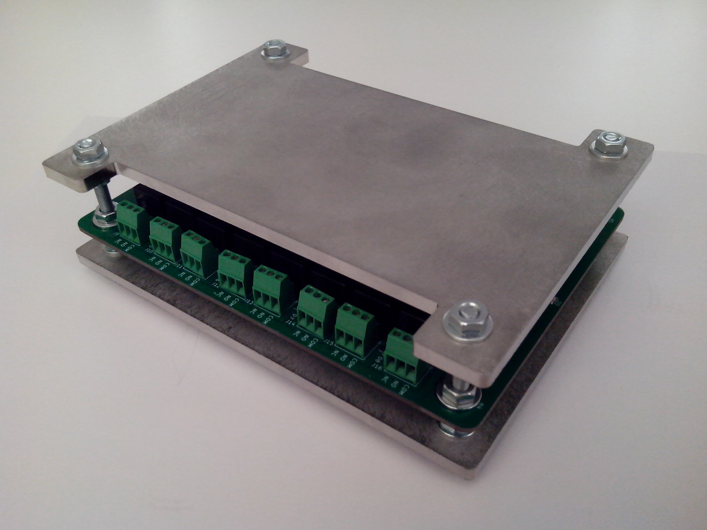
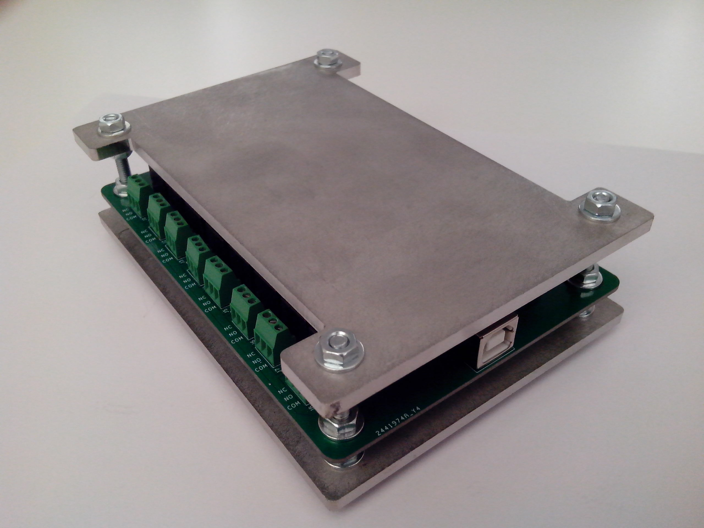
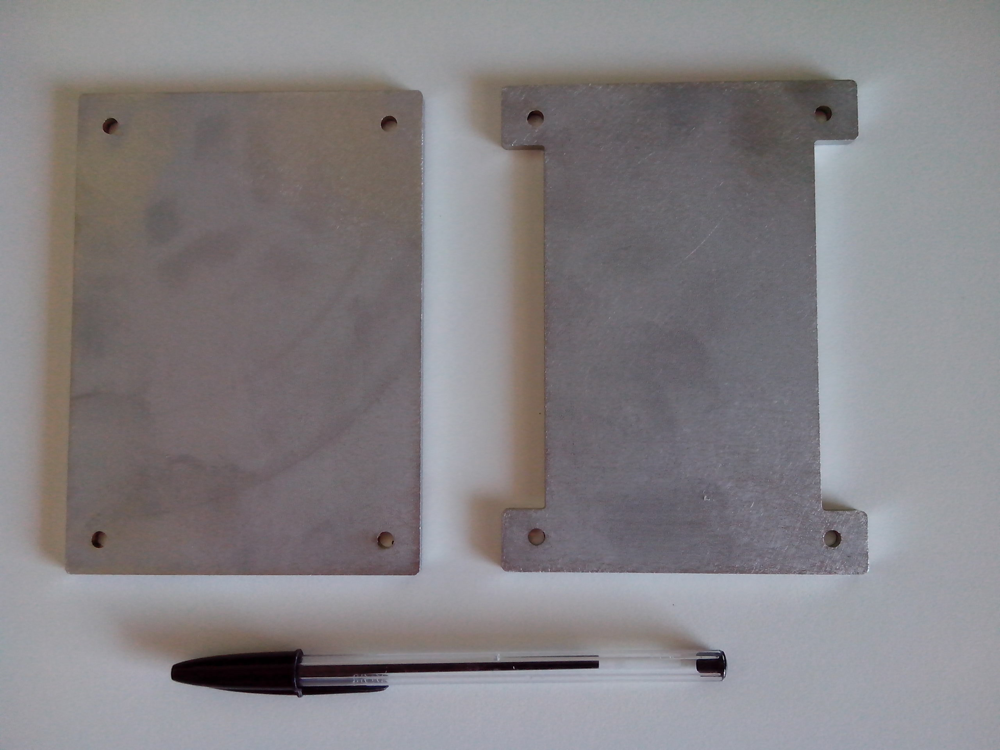
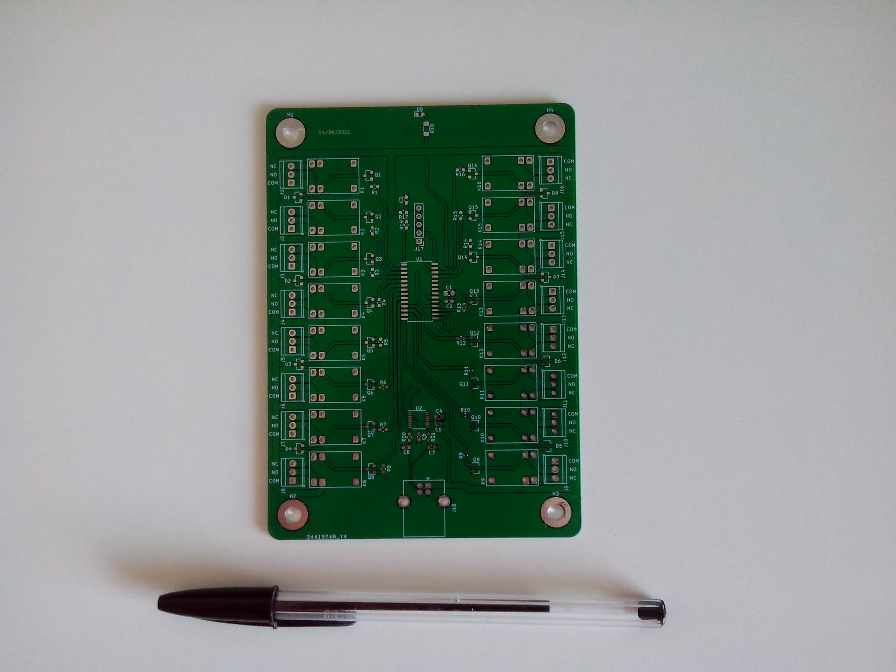
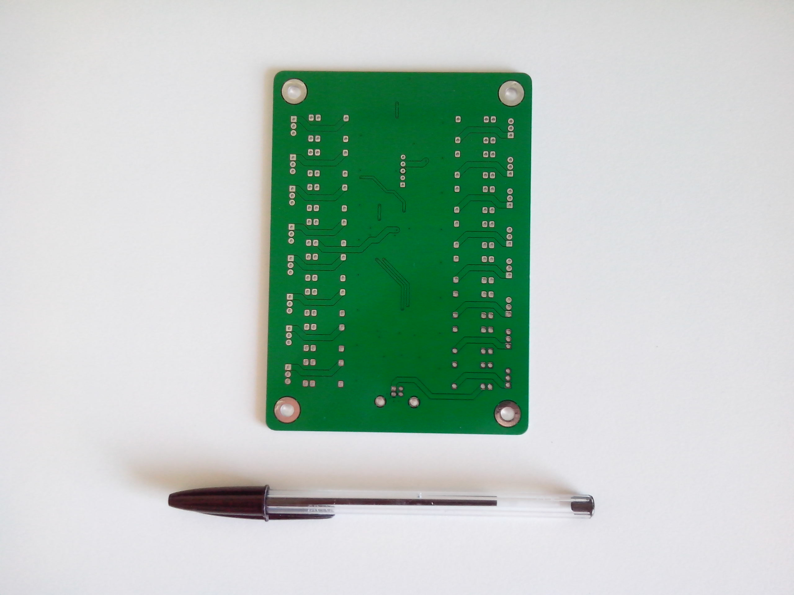
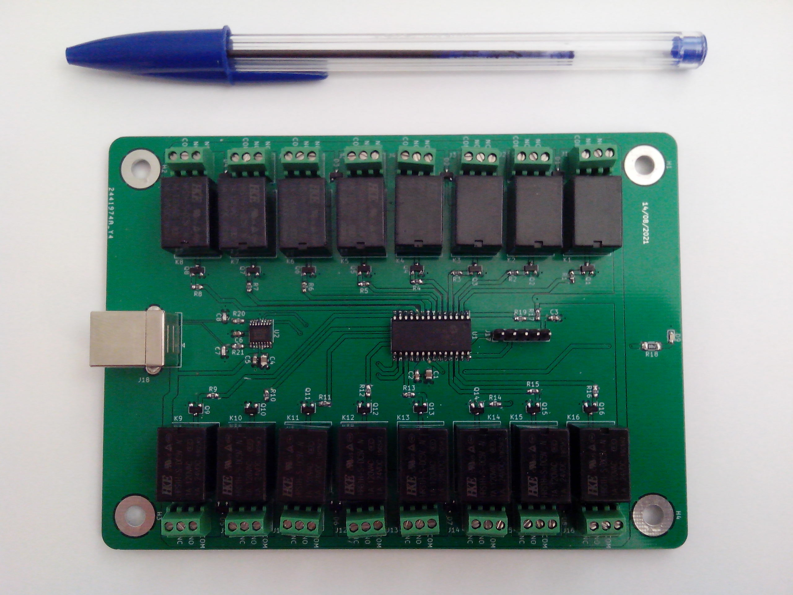
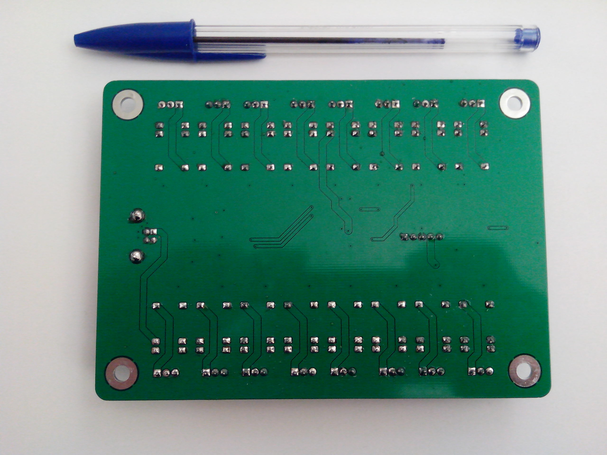
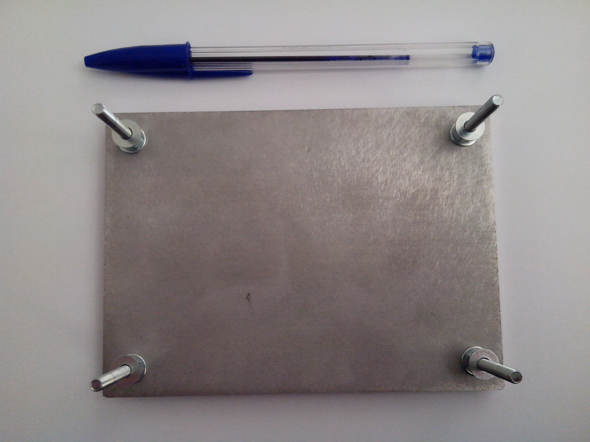
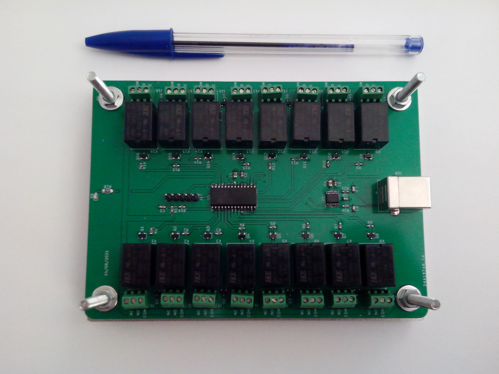
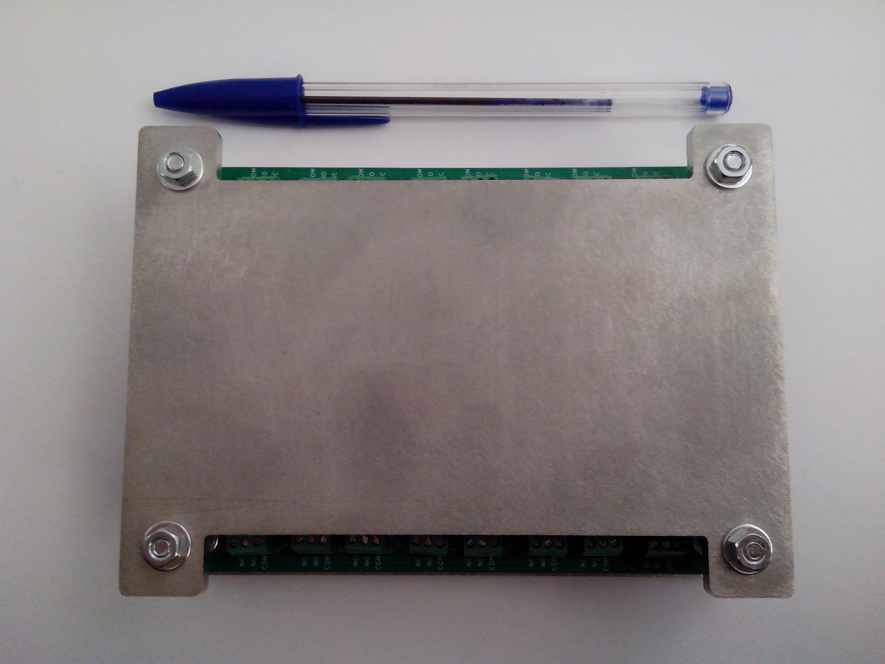

# USB relays

Control separately 16 signal relays through a PC by using a standard USB connection and a simple text-based serial protocol.  
Each relay can switch up to 3A at 24VDC (warning : this board is not designed for AC current).  
There is no need for a separate power supply to power the board, it is designed to be fully powered by the USB connection (that's why small relays are used).




## Communication protocol

* The board provides an USB serial port with the following settings : **9600 bits/s, no parity, 1 stop bit**.
* All commands are ASCII-only to allow to easily use the board with a simple serial port terminal like `Putty`, `minicom`, `picocom`, etc. If you plan to send commands manually, enable local echo and send CRLF when pressing enter key (see below). Here is an example picocom command invocation : `picocom --echo --omap crcrlf -b 9600 /dev/ttyUSB0`.
* All commands start with the character `#`. This way, if you mess up and write the commands into an UNIX terminal, they will be interpreted as comments.
* All commands end with CRLF characters (`\r\n`), so you only have to press `enter` key to send the command to the board.
* All commands sent to the board return an answer, the board will ignore all other commands while it is processing the current one. This allows to throttle a fast PC sending too much commands at a time, it must wait for each command answer before sending the next one.
* If you don't know the board state (for instance, the PC rebooted while it was sending a command and the board has received an incomplete command and is stuck waiting for the remaining part of the command), send the `!` character at any time. The board will immediately clear its reception buffer.

## Commands list

Use the `#H<CR><LF>` command to display the following list of commands :
```
Commands :
  - Get a relay state : #Gxx
    'xx' is the relay ID, from 1 to 16.
  - Display this help : #H
  - Set led state : #Lv
    'v' is the led state value (0 to turn off, 1 to turn on, 2 to make it blink).
  - Set relay state : #Sxxv
    'xx' is the relay ID, from 1 to 16.
    'v' is the relay state value (0 to clear, 1 to set).
  - Get firmware version : #V
```

## Photo gallery

### Casing plates

Plates are made of 4mm-thick 304 stainless steel.


### PCB

PCB top :


PCB bottom :


### Assembled PCB

Assembled PCB top :


Assembled PCB bottom :


### Casing assembly

Screwing the bolts on the casing lower steel plate :


Fixing the PCB :


Fixing the casing upper steel plate :

